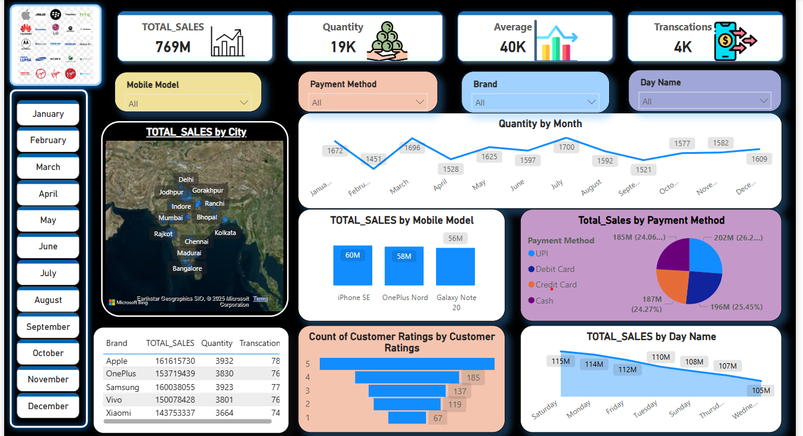

# 📊 Mobile Sales Dashboard (Power BI Project)

## 🔍 Overview

This project is a Power BI dashboard created to analyze **mobile phone sales data** over a given period. The dashboard provides insightful visualizations to help understand sales trends, top-performing products, and regional performance.

---

## 📁 Dataset

- **File name**: `Mobile Sales Data.xlsx`
- **Source**: Provided as part of a Mobile_Sales
- **Contents**: Daily sales records including product name, region, date (day/month/year), quantity sold, and more.

---

## 🧹 Data Cleaning & Transformation (in Power Query)

1. **Date Construction**:  
   Combined separate `Day`, `Month`, and `Year` columns to create a single, unified `Date` column.

2. **Missing Values**:  
   Checked all columns and confirmed there were **no null values**.

3. **Day Name Standardization**:  
   Replaced short day names (`Sun`, `Mon`, `Fri`, etc.) with full names (`Sunday`, `Monday`, `Friday`, etc.) for consistency.

4. **Data Types**:  
   Ensured all columns had the correct data types (e.g., `Date` column as Date, `Quantity` as Whole Number).

---

## 📈 Visualizations

The Power BI dashboard includes:

- 📅 **Sales Over Time** (line or area chart)
- 🌍 **Sales by Region** (map or column chart)
- 📱 **Top-Selling Mobile Phones** (bar chart)
- 📊 **Daily/Weekly Trends** (using day names)
- 🔎 **Interactive filters** for region, brand, or date range

---

## 🧠 Key Insights

- Identified peak sales days and regions with high demand
- Highlighted top-performing mobile phone models
- Observed sales patterns by day of the week

---

## 🚀 How to Use

1. Clone/download this repo
2. Open the `.pbix` file using [Power BI Desktop](https://powerbi.microsoft.com/desktop/)
3. Make sure the Excel file (`Mobile Sales Data.xlsx`) is in the same directory
4. Refresh the data to ensure all links are active

---

## 📌 Tools Used

- Power BI Desktop  
- Power Query (for ETL)  
- DAX (for calculated measures and KPIs)  
- Excel (source data)

---

## 📷 Preview

---

## 📄 License

This project is open-source and free to use for educational and non-commercial purposes.
